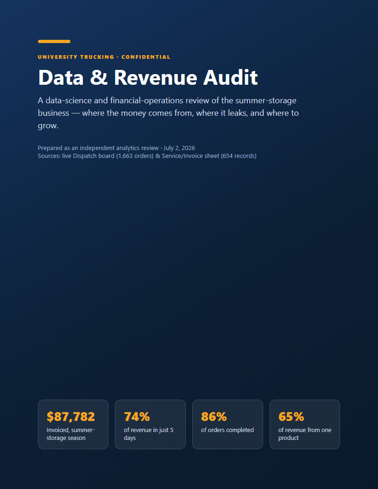
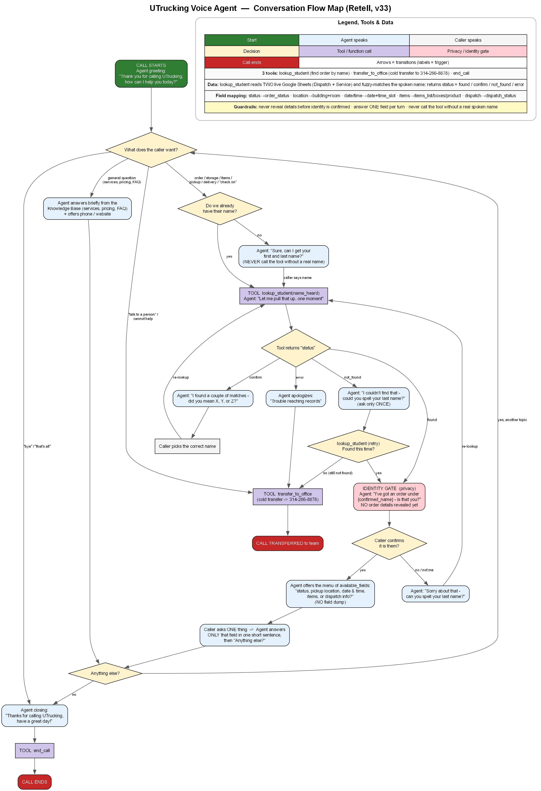

# UTrucking AI — Voice Assistant & Revenue Analytics

An end-to-end AI system for a university student **storage & moving** company: a production **voice phone assistant** that looks up orders and answers customers, plus a **data-science revenue audit** and a set of **automation engines** (instant quoting, capacity scheduling, billing-leakage detection).

> A real, deployed system — **Retell voice AI → Python backend on Render → Google Sheets**. Customer data and infrastructure secrets are intentionally excluded from this public repo.



## What it does

- **AI phone assistant** (Retell + GPT): warm, natural, one-answer-at-a-time calls; looks up any student's order across two data sources; **verifies identity before sharing anything**; transfers to a human on request.
- **Fuzzy name matching** with a confirmation gate to prevent wrong-customer matches.
- **Instant quote engine** — turns *"five boxes, a mini fridge and two duffels"* into an itemized quote; the price book is learned from historical invoices (validated **100%** against recorded totals).
- **Smart scheduler** — reads booking load per day and steers callers to open days (protects revenue that's **74% concentrated in 5 days**).
- **Billing-leakage guard** — flags `$0` / missing-invoice orders before they ship.
- **Automated reporting pipeline** — Markdown + Graphviz + matplotlib → a combined, bookmarked PDF report.

## Results from the data audit

Parsed from ~1,660 dispatch records and 654 itemized invoices:

- **$87,782** invoiced in a 13-day move-out sprint — **74%** of it in just 5 days
- **The UTrucking Box = 65% of revenue** (96.9% attach rate, $22 flat)
- **86.4%** order completion; **~$1,056** billing leakage identified
- Pricing insight: **+$2 / box = +$5,186 (+5.9%)** on low-elasticity demand

## Architecture

```
Caller ─▶ Retell Voice AI ─▶ Python backend (FastMCP + Starlette, on Render)
                                  │  lookup_student · quote · availability · billing_audit
                                  ▼
                         Google Sheets (live CSV)  —  dispatch board + invoices
```



## The engines — `backend/engines.py`

Pure, tested business logic (no I/O), wired into the backend as HTTP endpoints **and** MCP tools:

| Engine | Endpoint | What it does |
|---|---|---|
| Quote | `/quote` | itemized estimate from a structured list or free text |
| Availability | `/availability` | per-day load vs capacity + open alternative days |
| Billing guard | `/billing_audit` | flags `$0` / missing-invoice / missing-order leakage |

Validated against real data: **100%** invoice-total reproduction, exact leakage counts, correct peak-day steering.

## Tech stack

- **Voice AI:** Retell AI (GPT-backed), custom function calling, identity/guardrail prompting
- **Backend:** Python · FastMCP · Starlette · httpx — deployed on **Render**
- **Data:** Google Sheets (live CSV export) · pandas · numpy
- **Analytics & docs:** matplotlib · Graphviz · pypdf · headless-Chromium PDF pipeline

## Repo structure

```
backend/           Deployed Python service (sheet IDs redacted) + the A/B/C engines
source/            Doc & chart generators — build.ps1, flow maps (.dot), exec deck
source/analytics/  analyze.py · build_audit.py · engines.py · metrics.json (aggregate)
*.pdf              Generated deliverables: plan, data audit, flow maps, deck, QA log
assets/            README images
```

## Reproducibility

Every PDF regenerates from source (`source/build.ps1`); the data audit regenerates from `source/analytics/metrics.json` (aggregate, PII-free). Raw customer data (names, phones, addresses) and live infrastructure identifiers are intentionally excluded.

---

*A production system built for University Trucking. Repository curated for public sharing — customer data and infrastructure secrets removed.*
